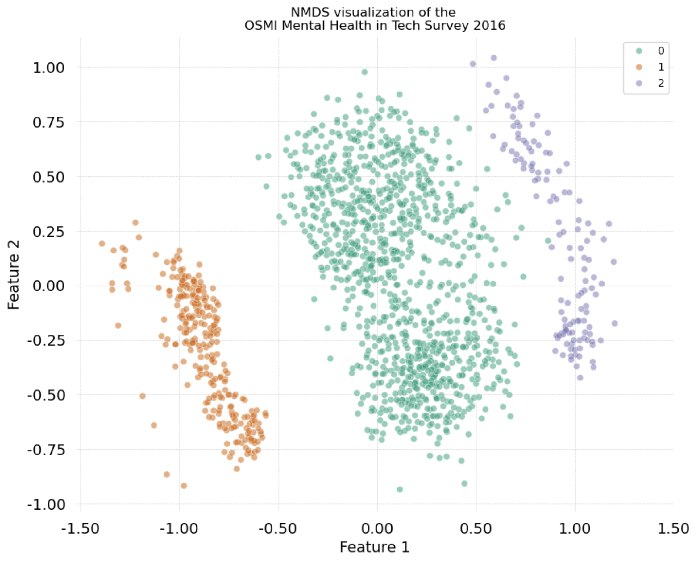

# IU International University of Applied Sciences

## Course: Unsupervised Learning (DLBDSMLUSL01)
Welcome to the repository of the Unsupervised Learning course. The task for this project consists in categorizing the participants of the OSMI Mental Health in Tech Survey 2016 according to their answers and providing visualizations that support the interpretation of the clusters.

### Objectives

1. Explore the dataset using descriptive statistics and explorative visualizations.
2. Decide how missing values should be handled.
3. Define a proper distance measure to differentiate the observations
4. Apply clustering algorithms to detect structure in the dataset

## Dataset information

Name: OSMI Mental Health in Tech Survey 2016

Source: [Kaggle](https://www.kaggle.com/datasets/osmi/mental-health-in-tech-2016) 

## Conda environment

This project was implemented using a conda environment. To replicate it, first clone the repository and then run:
```bash
cd IU_Unsupervised_Learning
conda env create -f environment.yml
conda activate unsup
```

## Results summary

By combining Gower's distance for mixed datatypes, Non-Metric Multidimensional Scaling for visualization and Hierarchical Clustering, three different clusters were identified.

The main axes for the separation of the clusters are given by two questions:

- Are you self-employed?
- Do you have previous employers?

In the plot shown below, Cluster 0 and Cluster 2 consist of salaried workers while Cluster 1 consists of self-employed workers, which explains why Cluster 1 is further away from Clusters 0 and 2.

Cluster 0 consists of workers who have had previous employers and cluster 2 consists entirely of workers with no previous employers.



## Acknowledgement

The test dataset used to validate the Gower distance implementation was adapted from the example in this repository: [gower](https://github.com/wwwjk366/gower)